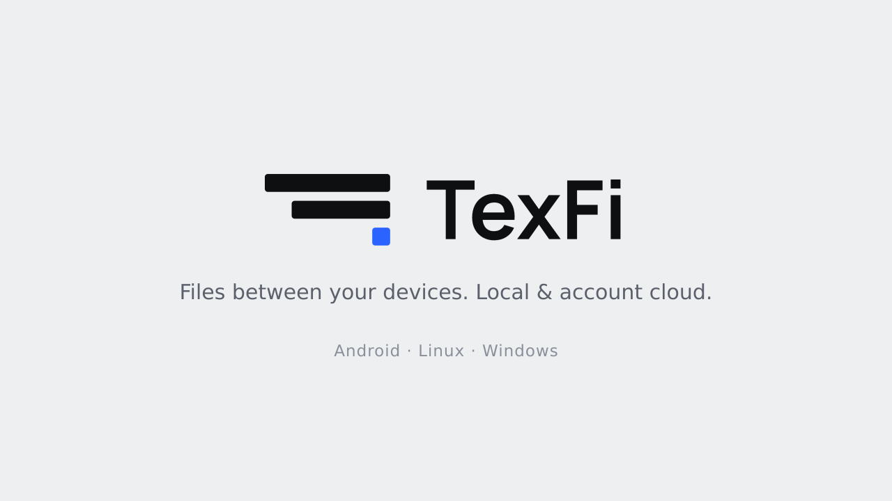

<div align="center">



# TexFi files

**Your own "Saved Messages", like Telegram — but local and without limits.**
Send text and files of any size directly between your phone and computer over Wi-Fi.
No cloud, no sign-up, no size limits.


</div>

---

## ⬇️ Download

| Platform | File | Link |
|----------|------|------|
| **Android** | `app-release.apk` | [Download APK](https://github.com/mistqkw/texfi_files/releases/latest/download/app-release.apk) |
| **Windows** | `TexFi-files-windows-x64.zip` | [Download for Windows](https://github.com/mistqkw/texfi_files/releases/latest/download/TexFi-files-windows-x64.zip) |
| **Linux** | build from source | [See below](#-build-from-source) |

All releases: [github.com/mistqkw/texfi_files/releases](https://github.com/mistqkw/texfi_files/releases)

---

## ✨ Features

- 📁 **Files of any size** — streamed over the local network, memory-friendly
- ⚡ **Instant and direct** — text, images, audio, video fly between devices
- 🎵 **Built-in player** — listen to music and watch video right in the app
- ⌨️ **Type from phone to PC** — the phone keyboard types on your computer (via `wtype`)
- 💾 **Save received files** in a couple of taps
- 🔍 **Auto-discovery** on the same Wi-Fi network + manual connection by IP
- 🎨 **Material 3**, dark and OLED themes, accent colors, settings

---

## 📱 How to use

1. Install TexFi files on your phone and your computer.
2. Connect both devices to the same Wi-Fi network.
3. They usually find each other automatically — see the **Devices** tab.
4. If not — open Devices on the PC, read the line
   `This device · 192.168.x.x:PORT`, and tap **"By IP"** on the phone.
5. Pick a target in the input bar and send text/files. Or **"Save here"** —
   locally, without sending.

> **Linux + firewall:** if the PC can't see the phone, open the ports:
> ```bash
> sudo firewall-cmd --permanent --add-port=45888/udp
> sudo firewall-cmd --permanent --add-port=45889-45899/tcp
> sudo firewall-cmd --reload
> ```

> **Keyboard on PC (Linux):** requires `wtype` — `sudo pacman -S wtype`.

---

## 🛠 Build from source

Requires [Flutter](https://flutter.dev) 3.44+.

```bash
git clone https://github.com/mistqkw/texfi_files.git
cd texfi_files
flutter pub get

# Linux
flutter build linux --release
bash packaging/install-linux.sh   # install as a native app

# Android
flutter build apk --release

# Windows
flutter build windows --release
```

Ready-to-use APK and Windows builds are produced automatically by **GitHub Actions**
on every push and attached to the release.

---

## 🧩 Tech

- **Flutter** — single codebase for Android, Linux and Windows
- **dart:io** — HTTP receive server and UDP device discovery (multicast + broadcast)
- **media_kit** — built-in audio/video player
- **wtype / ydotool** — input emulation on the PC for the "phone keyboard" feature

---

<div align="center">
Made with ❤️ in Flutter · open source
</div>
